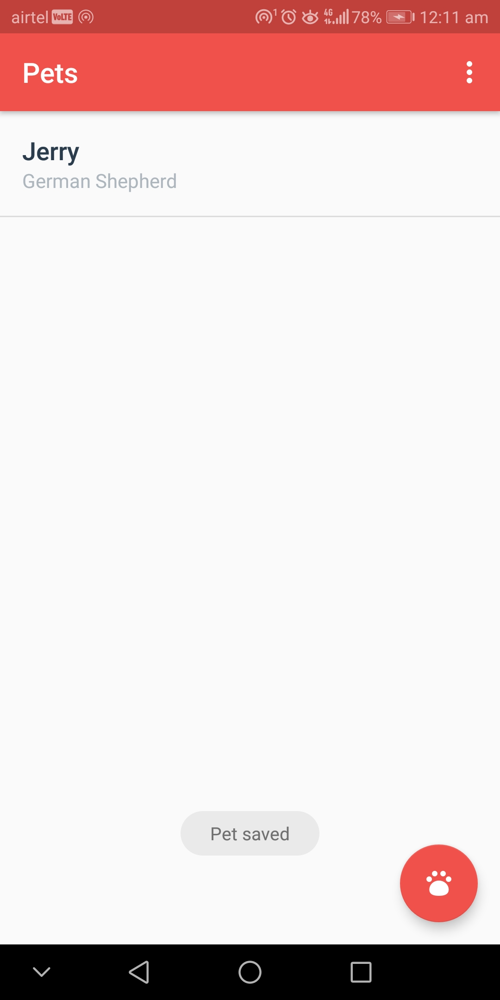

# Pets
Pets App is a convinient way to keep track of the pets data for Pet Stores where they can add info about new pets, chek details of the existing ones and delete the ones not required.

# How to implement?

1. Clone the repo or download the source code on your local machine.

# Screenshots

## Home Screen,  

      

## Editor Activity

        

## Empty View

  

## Menu Options

      

## Contributing

Contributions are always welcome!

If you have any suggestions or any feedback please create an issue.

Please adhere to this project's `code of conduct`.
 
## Installation 

If anyone needs the apk please, create an issue. 
    
## Support

For support, email pratyushsingh9473@gmail.com . 
